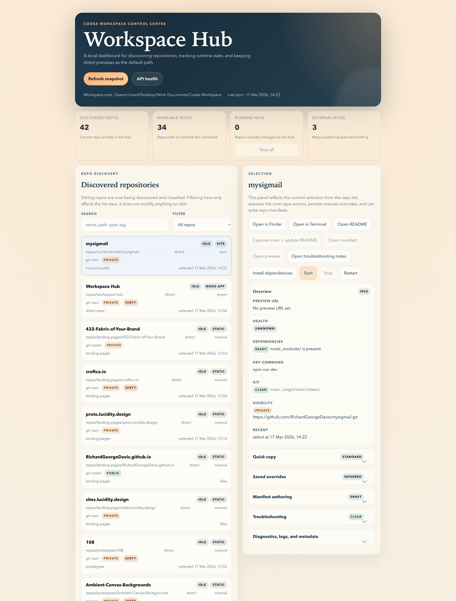

# Workspace Hub

<!-- workspace-hub:cover:start -->

<!-- workspace-hub:cover:end -->

Workspace Hub is a local control plane for people who manage many standalone repos on one machine. If your workspace mixes Vite apps, static sites, WordPress projects, PHP tools, and other repo-native runtimes, Workspace Hub gives you one place to discover them, run them, open previews, and keep lightweight repo metadata without forcing everything into a monorepo.

## At A Glance

| Area | What Workspace Hub does |
| --- | --- |
| Discovery | Scans sibling repos and classifies them conservatively |
| Runtime | Starts, stops, and restarts supported local repos |
| Visibility | Surfaces runtime, install, Git, and dependency-readiness state |
| Metadata | Stores lightweight repo metadata and recent context locally |
| Control model | Keeps each repo independently runnable instead of centralizing installs |

## Why Use It

- reduce context-switching across many local repos
- keep repo-native run models instead of centralizing dependencies
- support mixed stacks where monorepo tooling is a poor fit
- make local repo metadata explicit with lightweight manifests and overrides
- surface health, dependency, Git, and runtime state in one place

## Who It Is For

- developers juggling many independent local repos
- mixed-stack workspaces with frontend, WordPress, PHP, and utility projects
- teams that want a local-first tool rather than a hosted control plane

## What It Does

- scans sibling repos and classifies them conservatively
- supports direct local runtimes and external preview targets
- starts, stops, and restarts supported repos from one UI
- auto-starts supported direct local repos when `Open preview` is used and the local preview is not up yet
- shows runtime, install, Git, and dependency-readiness status
- detects repo-local agent surfaces such as `AGENTS.md`, `.agents/skills`, official `.codex/` config and skills, `.omx/`, and `.opencode/` configuration
- applies tracked repo-local agent presets for Codex baseline, OMX-ready, OpenCode, or an all-in-one setup directly from the details panel
- exports the shared workspace Playwright browser cache to repo install and runtime commands by default, so Playwright-based smoke runs can reuse one Chromium download
- streams live runtime, install, cover, and activity updates from the local API
- indexes repo metadata, manifests, side-load summaries, recent logs, failure reports, and local agent-job artifacts for server-side search, with a fast default `thin` mode plus an opt-in `deep` mode for heavier repo content
- reads generated repo side-load summaries on repo-detail hydration so operators can inspect context-cache freshness and open the generated `entry.md`, `abstract.md`, `overview.md`, and provenance files without paying for that metadata on every base summary refresh
- exposes a dedicated Workspace memory surface for MemPalace service state, target selection, in-app retrieval search, target-scoped graph builds, and safe wrapper actions
- builds target-scoped MemPalace graph artifacts from normalized sidecars and nearby markdown instead of introducing a second ingestion engine
- stores lightweight per-repo metadata and recent activity locally
- writes structured local failure reports for install and runtime errors
- includes persisted appearance controls with five built-in presets and light or dark mode
- can initialize repo intake docs by creating or tightening `README.md`, adding a repo-local cover block and placeholder image, and creating a manifest only when the repo needs explicit runtime metadata
- reads and writes `.workspace/project.json` manifests when a repo needs explicit behaviour
- captures repo cover screenshots from live previews and can insert them into repo `README.md` files
- gives plain static repos a lightweight direct local server when they do not already have a dev script
- exposes the current workspace agent environment, shared skill packs, and setup scripts so reviewed reference patterns can be promoted into the base workspace instead of left in `tools/ref/`

## Stack

- React
- Vite
- TypeScript
- Node
- Express

## Workspace Root

Workspace Hub treats the folder named `Codex Workspace/` as the workspace root.

That means the important thing is the folder structure, not the exact disk location. These are both valid examples:

```text
~/Workspaces/Codex Workspace/
/Volumes/FastSSD/Codex Workspace/
```

Workspace root means: the folder that contains `repos/`, `cache/`, and `shared/`.

## Workspace Layout

Default layout:

```text
Codex Workspace/
├── repos/
│   └── workspace-hub/
├── cache/
└── shared/
```

If the workspace lives somewhere else on disk, set `WORKSPACE_HUB_WORKSPACE_ROOT` to the `Codex Workspace/` folder before starting the app.

Example:

```bash
export WORKSPACE_HUB_WORKSPACE_ROOT="$HOME/Code/Codex Workspace"
pnpm dev
```

If you want repo cover screenshots to use a specific browser binary, set:

```bash
export WORKSPACE_HUB_SCREENSHOT_BROWSER="/Applications/Google Chrome.app/Contents/MacOS/Google Chrome"
```

If you want a single default cover path convention across repos, set:

```bash
export WORKSPACE_HUB_COVER_RELATIVE_PATH=".github/assets/cover.png"
```

If repo covers are being captured before the page has visually settled, you can increase the wait:

```bash
export WORKSPACE_HUB_SCREENSHOT_SETTLE_MS="5000"
export WORKSPACE_HUB_SCREENSHOT_VIRTUAL_TIME_MS="10000"
```

If you want to tune workspace discovery caching for summary refreshes, set:

```bash
export WORKSPACE_HUB_DISCOVERY_CACHE_TTL_MS="1500"
```

`WORKSPACE_HUB_DISCOVERY_CACHE_TTL_MS` is in milliseconds and defaults to `1500`.
Set it to `0` to effectively disable caching for debugging.

If you want indexed search to include local agent-job artifacts under `cache/context/agents/jobs`, enable:

```bash
export WORKSPACE_HUB_SEARCH_INCLUDE_ARTIFACTS="true"
```

`WORKSPACE_HUB_SEARCH_INCLUDE_ARTIFACTS` is disabled by default to reduce accidental indexing of local artifact content.
Accepted truthy values are `1`, `true`, `yes`, and `on`.

## About `repos/`

`repos/` should remain in the workspace.

- on disk: it contains the child repositories, including `repos/workspace-hub/`
- in the top-level workspace Git repo: it should be ignored, so it acts as a container rather than tracked project content

So `repos/` should exist, but the root workspace repo should not try to version the nested repos inside it.

## Quick start

Prerequisites:

- Node.js 20+
- pnpm 9+
- a Chrome-compatible browser for cover screenshots, or `WORKSPACE_HUB_SCREENSHOT_BROWSER`

Install dependencies:

```bash
pnpm install
```

Start the app:

```bash
pnpm dev
```

Useful commands:

```bash
pnpm test
pnpm typecheck
pnpm lint
pnpm build
pnpm preview
```

To generate the workspace-side AI summaries that the repo-details panel can inspect, run from the workspace root:

```bash
tools/scripts/generate-context-cache.sh --workspace --run
tools/scripts/generate-context-cache.sh --repo workspace-hub --run
```

The automated test suite uses temp workspaces and fixture repos so it does not
rewrite your current `repos/` content while verifying agent detection and
preset scaffolding.

Quick verify (optimization pass):

```bash
pnpm typecheck
pnpm test
curl -s "http://127.0.0.1:4101/api/workspace/summary/base?reason=event" > /dev/null
curl -s "http://127.0.0.1:4101/api/workspace/summary?reason=manual-refresh" > /dev/null
curl -s "http://127.0.0.1:4101/api/capabilities"
curl -s "http://127.0.0.1:4101/api/workspace/observability"
```

Manual smoke (live Hub acceptance):

```bash
pnpm dev:api
pnpm dev:web --host 127.0.0.1 --port 4174
curl -s http://127.0.0.1:4101/api/workspace/summary/base | jq '{repoCount: (.repos | length), capabilityCount: (.capabilities | length), firstRepo: (.repos[0] | {relativePath, detailLevel})}'
curl -s http://127.0.0.1:4101/api/capabilities | jq '{generatedAt, stats}'
curl -s "http://127.0.0.1:4101/api/search?q=memory&mode=thin" | jq '{mode, total: (.results | length), categories: (.results | map(.category))}'
curl -s "http://127.0.0.1:4101/api/search?q=memory&mode=deep" | jq '{mode, total: (.results | length), categories: (.results | map(.category))}'
curl -s -X POST http://127.0.0.1:4101/api/services/context -H 'Content-Type: application/json' -d '{"serviceId":"mempalace","targetKind":"workspace-docs"}' | jq '{targetLabel, graph: .graph | {lastBuiltAt, nodeCount, edgeCount}}'
curl -s -X POST http://127.0.0.1:4101/api/services/command -H 'Content-Type: application/json' -d '{"serviceId":"mempalace","commandId":"search","searchQuery":"workspace memory"}' | jq '{command, ok}'
curl -s -X POST http://127.0.0.1:4101/api/services/command -H 'Content-Type: application/json' -d '{"serviceId":"mempalace","commandId":"build-graph"}' | jq '{command, ok}'
curl -s --get http://127.0.0.1:4101/api/repos/details --data-urlencode "relativePath=repos/workspace-hub" | jq '{relativePath, detailLevel, diagnosticsFreshness}'
curl -s http://127.0.0.1:4101/api/health | jq '.workspaceHub.repoDetails'
npx playwright screenshot --wait-for-selector 'text=Workspace memory' http://127.0.0.1:4174 /tmp/workspace-hub-workspace-memory.png
npx playwright screenshot --wait-for-selector 'text=Workspace Capabilities' --full-page http://127.0.0.1:4174 /tmp/workspace-hub-capabilities.png
npx playwright screenshot --wait-for-selector 'text=Repo Discovery' --full-page http://127.0.0.1:4174 /tmp/workspace-hub-repo-discovery.png
cat > /tmp/workspace-hub-discovery-storage.json <<'EOF'
{
  "cookies": [],
  "origins": [
    {
      "origin": "http://127.0.0.1:4174",
      "localStorage": [
        {
          "name": "workspace-hub.repo-layout",
          "value": "\"discovery-first\""
        }
      ]
    }
  ]
}
EOF
npx playwright screenshot --load-storage /tmp/workspace-hub-discovery-storage.json --wait-for-selector 'text=Select a repo to open details.' --full-page http://127.0.0.1:4174 /tmp/workspace-hub-discovery-mode.png
```

That smoke pass validates the current base-summary list projection, indexed capability-aware search, selected repo-detail hydration, `Workspace memory`, the in-app MemPalace search flow, target-scoped graph builds, the capability panel, the discovery-first inline empty-state prompt, and the inline selected-repo details rendering path.

Default local endpoints:

- app: `http://127.0.0.1:4100`
- api: `http://127.0.0.1:4101/api/health`
- observability: `http://127.0.0.1:4101/api/workspace/observability`
- events: `http://127.0.0.1:4101/api/events`
- search: `http://127.0.0.1:4101/api/search?q=preview`
- search (thin): `http://127.0.0.1:4101/api/search?q=preview&mode=thin`
- search (deep): `http://127.0.0.1:4101/api/search?q=preview&mode=deep`
- capabilities: `http://127.0.0.1:4101/api/capabilities`

Summary endpoints:

- full summary (with diagnostics): `GET /api/workspace/summary`
- base summary (fast discovery-first): `GET /api/workspace/summary/base`
- capabilities snapshot (read-only operator state): `GET /api/capabilities`

The UI now prefers base summary for frequent refreshes and hydrates full diagnostics when needed.
The capability panel now also reads a dedicated read-only capability snapshot so operators can inspect installed, enabled, and reference-only counts without inferring them from the broader workspace summary.
Repo details now also read optional side-load metadata for the selected repo only, so the `Context cache` block can show `missing`, `fresh`, or `stale` generated summary state without slowing the discovery-first list path.
The `Context cache` block now treats generated `entry.md` as the default operator handoff packet and can still open the deeper side-load files when needed.
Indexed search now defaults to `thin` mode so repo discovery, manifest signals, and side-load summaries remain cheap to query, with `deep` mode available when you explicitly want heavier repo-local content included.
Observability now includes cache hit or miss counters, diagnostics cache behavior, eager repo-details request timing, and summary request reasons to support tuning.
`/api/workspace/observability` now exposes a versioned schema (`observabilityVersion: 2`) with grouped sections (`discovery`, `diagnostics`, `repoDetails`, `summary`); current top-level counters remain as compatibility aliases for existing consumers.

## Repo Intake

Workspace Hub can now scaffold the first-pass repo docs for a newly added repo directly from the details panel.

- `Run repo intake` creates or normalizes `README.md`
- it injects the marked cover block and ensures a repo-local placeholder image such as `docs/cover.png` exists
- it creates `.workspace/project.json` only when the repo looks like it needs explicit runtime metadata
- it leaves repos with already-clear runtime behavior alone instead of forcing a manifest

The intake action uses the tracked templates in `tools/templates/repo-docs/` so the starter README and placeholder cover path stay consistent across repos.

## Repo Covers

Repo covers are a built-in Workspace Hub feature.

- the selected repo can generate a cover from its live preview
- the intake action can prepare the README cover block and placeholder image before a live preview exists
- the image is stored inside that repo, not in a central workspace folder
- Workspace Hub updates a marked block in the repo `README.md` so repeated captures replace the current cover instead of duplicating it
- static repos with inferred direct previews can temporarily bootstrap their lightweight local server during capture
- cover capture now waits for the preview to settle before taking the screenshot, and that delay is configurable

Cover path resolution is future-proofed with fallbacks:

1. use `WORKSPACE_HUB_COVER_RELATIVE_PATH` if you set it
2. otherwise keep using the existing marked cover image path if the README already has one
3. otherwise prefer common repo asset paths such as `docs/cover.png`, `.github/assets/cover.png`, `assets/cover.png`, `images/cover.png`, or `screenshots/cover.png`
4. if none of those folders exist, fall back to `docs/cover.png`

## Repo Model

Workspace Hub is designed for workspaces that contain a mix of:

- Vite, static, Three.js, and other frontend repos that usually run best on direct local ports
- WordPress repos that are often managed by Local or another external runtime
- server-side repos that should keep their own native run model

It aims to share caches, not installs, and to keep each repo independently runnable.

## Optional Workspace Dependencies

Workspace Hub can surface workspace abilities and core services, but it should not silently depend on optional abilities being installed.

Current expectation:

- core services such as MemPalace can be surfaced from the tracked workspace capability registry
- optional abilities should be treated as installable helpers, not baseline repo requirements
- if this repo ever requires an optional ability for a real workflow, that dependency must be documented here and in the relevant repo-local docs
- install or update those optional helpers through `tools/scripts/manage-workspace-capabilities.sh`, not through `update-all.sh`

At the moment, Workspace Hub has no required optional ability dependency.

## Workspace Memory Graph

Workspace Hub now includes a Phase 1 graph flow for Workspace memory.

Current model:

- keep MemPalace as the memory source of truth
- normalize target-scoped MemPalace sidecars plus nearby markdown into a graph export
- write rebuildable graph artifacts under `cache/mempalace/<user>/graphs/`
- expose `Build graph`, `Rebuild graph`, `Open graph`, and `Open graph folder` from the Workspace memory page

This is intentionally a derived view, not a second memory engine beside MemPalace.

The design note and implementation reference live in [docs/memory-graph.md](./docs/memory-graph.md).

## Safety And Trust

Workspace Hub executes repo-native commands locally. It is meant for repos you trust.

- runtime and install commands are executed through the local shell
- local metadata lives under `data/` and should stay untracked
- local failure reports live under `data/failure-reports/` and should stay untracked
- public defaults can live in `.workspace/project.json`
- local-only overrides can live in `.workspace/project.local.json`

## Why Not A Monorepo Tool

Workspace Hub is for cases where the workspace is intentionally a collection of independent repos:

- different stacks
- different package managers
- different run models
- different ownership or deployment boundaries

It helps organize that reality instead of trying to flatten it.

## Local Overrides

Use local override files when you want to keep your own operator notes or machine-specific metadata without publishing them:

- `.workspace/project.local.json` for local manifest overrides
- `docs/*.local.md` for private operator notes

## Docs

- [Doc conventions](docs/INSTRUCTIONS.md)
- [Appearance guide](docs/appearance.md)
- [Local override guide](docs/local-overview.md)
- [Manifest guide](docs/manifest.md)
- [Runtime troubleshooting](docs/runtime-troubleshooting.md)
- [Extension guide](docs/skills.md)

## Current Limitations

- richer dependency detection beyond Node and Composer is still pending
- runtime state is local and in-memory, not shared across machines
- indexed search is intentionally lightweight and local-first, not a hosted code intelligence layer
- the tool assumes a trusted local workspace rather than untrusted repos
- synced folders such as Google Drive, iCloud, or Dropbox can interfere with `.git` directories and should be avoided

## Roadmap

1. Add richer dependency detection beyond Node and Composer.
2. Tighten install guidance for more mixed-stack repo types.
3. Expand lightweight workflow helpers only where they reduce repeated local setup work.

## Current Follow-ups

Near-term operator follow-ups:

- monitor `GET /api/workspace/observability` for:
  - discovery cache hit/miss balance
  - diagnostics cache miss pressure
  - summary request reason distribution
- keep tuning conservative and local-first:
  - `WORKSPACE_HUB_DISCOVERY_CACHE_TTL_MS`
  - `WORKSPACE_HUB_DIAGNOSTICS_CACHE_TTL_MS`
  - `WORKSPACE_HUB_DIAGNOSTICS_WORKER_CONCURRENCY`
- use a quick triage flow when refresh feels slow:
  1. check observability counters first
  2. compare warm `summary/base` vs `summary` response behavior
  3. adjust one env knob at a time and re-measure

Mid-term and longer-term follow-ups:

- incremental discovery indexing to reduce cold-start outliers on larger workspaces
- optional extension hooks for custom repo classification and health/dependency probes
- optional local historical observability snapshots for trend visibility

Current layout note:

- `Appearance` owns the `split` / `discovery-first` toggle
- in `discovery-first`, Repo Discovery stays full width until a repo is selected
- once selected, the repo expands inline with its full detail surface instead of showing a second detached selection block lower on the page

## Next Batches

- Batch 1: Memory graph Phase 2, only if operators need it.
  Add better derived relationships, filtering, and optional in-app embedding only when the current file-open graph flow stops being enough.
- Batch 2: Capability status drill-down.
  Add deeper per-capability state such as post-install command health or last update output if operators need more than the current read-only snapshot and action feedback.
- Batch 3: Repo intake polish.
  Tighten intake output so new repos get clearer runtime notes, explicit optional ability dependency guidance when relevant, and better first-run defaults.
Each generated side-load bundle now includes an `entry.md` routing packet alongside the deeper summaries and provenance files.
The repo-details panel opens that packet first, and indexed search uses the lighter side-load material by default unless you explicitly switch to `deep` mode.
